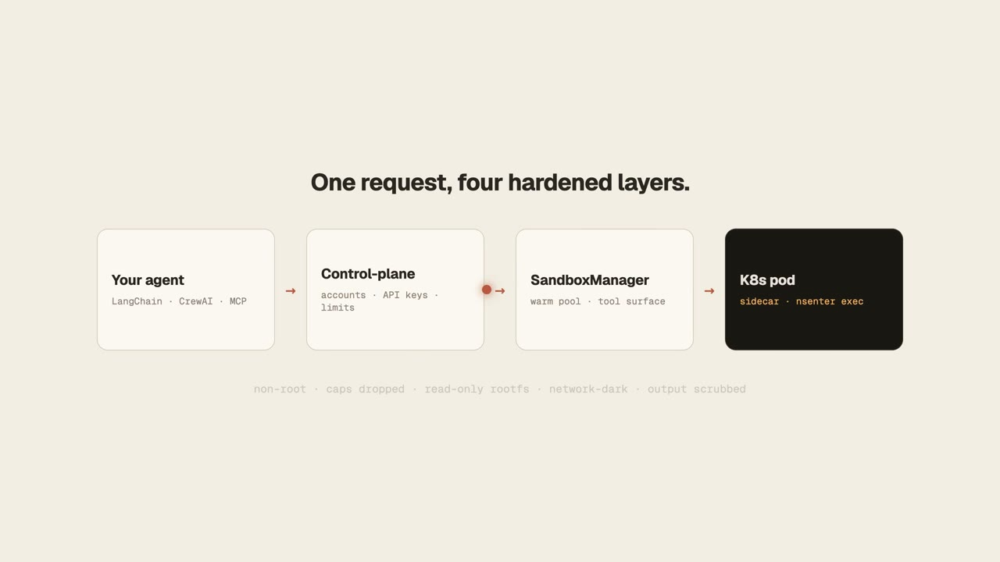

<p align="center">
  
</p>

<h1 align="center">boxxkite</h1>

<p align="center">
  <a href="LICENSE"></a>
  <a href="https://github.com/EvAlssment/boxxkite/actions/workflows/ci.yml"></a>
  <a href="https://pypi.org/project/boxxkite-sandbox/"></a>
  <a href="https://www.npmjs.com/package/boxxkite-client"></a>
  <a href="https://pkg.go.dev/github.com/EvAlssment/boxxkite/sdk-go"></a>
  <a href="https://crates.io/crates/boxxkite-client"></a>
  <a href="https://boxxkite.com/discord"></a>
</p>

<p align="center">
  <a href="https://boxxkite.com">Website</a> ·
  <a href="#quickstart">Quickstart</a> ·
  <a href="https://boxxkite.com/developers">Docs</a> ·
  <a href="#self-hosting">Self-hosting</a> ·
  <a href="#security">Security</a> ·
  <a href="examples/">Examples</a> ·
  <a href="https://boxxkite.com/discord">Discord</a>
</p>

<p align="center">
  <a href="https://boxxkite.com" title="Watch the boxxkite demo">
    
  </a>
</p>
<p align="center">
  <a href="https://boxxkite.com">▶ Watch the demo</a>
</p>

**The missing batteries-included, self-hostable sandbox for agent code execution.**

Most "agent sandbox" projects give you raw isolation — a pod, a VM, a container —
and leave you to build the tool surface an LLM agent actually needs on top of it.
boxxkite is the other half: a complete `bash`/`python`/file/search/process tool
surface running inside real Kubernetes pod isolation, self-hostable end to end.
Point your agent framework at it and you have a real sandbox in minutes, on
infrastructure you control.

- **15 framework-agnostic tools** (plus an opt-in 8-tool git set) — LangChain,
  LangGraph, LlamaIndex, CrewAI, AutoGen, the OpenAI Agents SDK, or plain
  function calling, with no required dependency on any of them
- **One Kubernetes pod per session** — non-root, all capabilities dropped,
  read-only root filesystem, network egress denied by default
- **A hosted-API control-plane you run yourself** — accounts, API keys,
  fair-use limits, and client SDKs in four languages, if you want a real
  multi-tenant API in front of the sandbox instead of embedding it directly
- **CLI, MCP server, Helm chart, and a one-click Render deploy** for the
  control-plane — see [Self-hosting](#self-hosting)
- **Nothing held back.** Every piece here — runtime, control-plane, all four
  SDKs, the MCP server — is Apache-2.0-licensed and self-hostable; there's no
  separate closed hosted-only tier

**Who this is for:** teams *building their own agent products* that need
isolated, multi-tenant code execution at scale. It's **not** a single-user
local dev-session sandbox like the built-in `bash` tool in an IDE or CLI
coding agent — if you just want your own assistant to run shell commands on
your machine, boxxkite is the wrong layer.

## Start Here

If you are new to the repo, use this decision tree:

1. **I just want to try the sandbox locally**  
   Use `boxxkite up` from the Quickstart below. This is the fastest path and
   does not require Kubernetes.
2. **I want the real Kubernetes deployment on my laptop**  
   Use [`deploy/local-kind/README.md`](deploy/local-kind/README.md). It
   explains the kind-based flow, the Apple Silicon limitation, and the
   `kubectl proxy` step.
3. **I want the hosted API / multi-tenant control-plane**  
   Use the control-plane section below, then the
   [`examples/hosted_control_plane/`](examples/hosted_control_plane/) guide.

For contributors, the important mental model is: the root package gives you
the sandbox runtime, while `control-plane/`, the SDKs, and `mcp-server/` are
separate packages with their own installs and tests.

## Quickstart

Clone the repo, create a virtualenv, install the root package, then start
the local stack:

```bash
git clone https://github.com/EvAlssment/boxxkite.git boxxkite && cd boxxkite
python3 -m venv .venv
source .venv/bin/activate
pip install -e ".[dev]"
boxxkite up                # builds + starts sandbox, sidecar, and local MinIO
boxxkite exec "python3 -c 'print(1 + 1)'"
```

> Running the test suite needs two extra things the quickstart above doesn't:
> `pip install -r sidecar/requirements.txt` (several tests import
> `sidecar/main.py` directly, and its dependencies are tracked separately from
> `pyproject.toml`) and `tmux` on your PATH (it backs the sidecar's PTY
> takeover session; tmux-dependent tests skip cleanly without it). See
> [CONTRIBUTING.md](CONTRIBUTING.md#development-setup).

> The PyPI name is `boxxkite-sandbox`, not `boxxkite` (already taken). Install
> it with `pip install -e ".[dev]"` from the repo root; the import path
> (`import boxxkite`) and the `boxxkite` CLI command are unaffected.

If `boxxkite up` succeeds, the quickest smoke test is:

```bash
boxxkite exec "python3 -c 'print(1 + 1)'"
boxxkite files ls /
```

That confirms the sandbox, the sidecar, and the CLI are talking to each other
correctly.

```python
from uuid import uuid4
from boxxkite import SandboxManager
from boxxkite.tools import create_sandbox_tool_specs

manager = SandboxManager()
session_id = str(uuid4())
await manager.create_session(organization_id=uuid4(), session_id=session_id)

specs = create_sandbox_tool_specs(sandbox_manager=manager, session_id=session_id)
bash_tool = next(s for s in specs if s.name == "bash_tool")
result = await bash_tool.handler(command="echo hello from boxxkite")
```

Framework adapters (`boxxkite.tools.adapters`) convert the same tool specs for
LangChain, LlamaIndex, the OpenAI Agents SDK, or plain OpenAI/Anthropic/
Gemini/Mistral function-calling schemas — see the
[full integration guide](https://boxxkite.com/developers/guides/quickstart)
and [`examples/`](examples/) for a runnable version of every framework.

## Self-hosting

Everything in this repo — including the `control-plane/` hosted multi-tenant
API — is something you deploy yourself:

- **Real Kubernetes** — two steps. First lay down the cluster prerequisites
  (RBAC, NetworkPolicy, pod-security admission policy, ServiceAccount,
  Config/Secret scaffolding) by applying `deploy/rbac.yaml`/
  `network-policy.yaml`/`pod-security-policy.yaml`, or
  `helm install boxxkite deploy/helm/boxxkite`. This chart does **not** deploy
  the control-plane itself (it has no Deployment/Service) — the per-session
  sandbox pods are created programmatically by the control-plane at runtime.
  Then deploy the `control-plane/` API separately (see the Render button
  below or the [developer docs](https://boxxkite.com/developers)).
  A local `kind` cluster works too: `./deploy/local-kind/setup.sh`.
- **One-click Render deploy** for the control-plane API —
  [](https://render.com/deploy?repo=https://github.com/EvAlssment/boxxkite)
  (still needs a real Kubernetes cluster for actual sandbox execution).
- **docker-compose**, for local iteration without a cluster — see the
  Quickstart above.

> docker-compose mode shares a PID namespace with the sandbox container and
> execs into it via `nsenter`, the same mechanism the Kubernetes runtime
> uses — it no longer needs (or mounts) the host's Docker socket. See
> [SECURITY.md](SECURITY.md) for the current list of disclosed limitations.

Full walkthroughs for every path above (Kubernetes, Helm, Render, the
`boxxkite` CLI's hosted mode, secrets, webhooks, MCP, and every SDK) live on
the [developer docs site](https://boxxkite.com/developers).

### Run the control-plane locally

The `control-plane/` multi-tenant API is a **separate service** from the
`boxxkite up` SDK path — it is *not* part of `deploy/docker-compose.yml`, and you
run it on its own. To bring it up against a throwaway SQLite database (no
Postgres required) for API exploration:

```bash
cd control-plane
uv venv                              # create .venv
uv pip install -e '../[dev]'         # install the boxxkite runtime (sibling pkg)
uv pip install -e '.[dev]'           # install the control-plane itself
ENVIRONMENT=development DATABASE_URL=sqlite+aiosqlite:///./cp.db \
  uv run uvicorn control_plane.main:app --port 8099
```

Then check it's up:

- `http://localhost:8099/health` — liveness (process is up)
- `http://localhost:8099/health/ready` — readiness (round-trips a DB query)
- `http://localhost:8099/docs` — interactive OpenAPI docs

This gets you the API surface (accounts, API keys, session bookkeeping), but
**actually executing sandbox pods still needs a real Kubernetes cluster** — the
control-plane creates per-session pods programmatically at runtime (a local
`kind` cluster via `deploy/local-kind/setup.sh` works). Against SQLite with no
cluster you can exercise the HTTP/auth surface, not real code execution.

## What's in this repo

One repo, several independently-versioned pieces, kept together deliberately
(see [CONTRIBUTING.md](CONTRIBUTING.md)):

| Piece | What it is |
|---|---|
| `src/boxxkite/` (`boxxkite-sandbox` on PyPI) | The core: `SandboxManager`, `WarmPoolManager`, and the 15+ tool `boxxkite.tools` surface. Embed this directly against your own cluster. |
| `sidecar/` | The FastAPI service that runs in every sandbox pod — filesystem I/O, command exec via `nsenter`, storage sync. |
| `control-plane/` | Optional hosted-API layer in front of `SandboxManager` — accounts, API keys, fair-use limits. |
| `sdk-python/`, `sdk-js/`, `sdk-go/`, `sdk-rust/` | Thin HTTP clients for *your own* running control-plane. |
| `mcp-server/` (`boxxkite-mcp`) | Wraps the Python SDK as an MCP tool source for Claude Code, Claude Desktop, Codex, or Cursor. |
| `handoff-cli/` (`boxxkite-handoff`) | Moves an in-progress local Claude Code/Codex CLI/opencode session into a fresh sandbox, full conversation history included — see [docs/handoff-adapters.md](docs/handoff-adapters.md). Not yet published. |
| `bastion/` | Standalone SSH server bridging into a session's human-takeover WebSocket. |
| `deploy/` | Kubernetes manifests, Helm chart, Dockerfiles, docker-compose, Render Blueprint. |
| `examples/` | Runnable cookbook — LangGraph, LangChain, raw HTTP, OpenAI/Gemini/Mistral function calling, and more. |

## Security

boxxkite executes arbitrary, agent-generated code — its security posture is
layered defense in depth: a per-pod shared-secret sidecar auth token, a
fresh empty network namespace on every `exec` call, non-root execution with
every Linux capability dropped, and a read-only root filesystem. No single
one of these is meant to stand alone.

See [SECURITY.md](SECURITY.md) for the full model, known limitations, and
how to report a vulnerability privately — this project runs arbitrary code,
so a sandbox-escape report deserves a fast, private path, not a public
issue. The [security model guide](https://boxxkite.com/developers/guides/security-model)
covers the same ground with runnable examples.

## Published packages and images

| Package | Registry |
|---|---|
| `boxxkite-sandbox` | [PyPI](https://pypi.org/project/boxxkite-sandbox/) |
| `boxxkite-client` (Python) | [PyPI](https://pypi.org/project/boxxkite-client/) |
| `boxxkite-client` (JS/TS) | [npm](https://www.npmjs.com/package/boxxkite-client) |
| `boxxkite-mcp` | [PyPI](https://pypi.org/project/boxxkite-mcp/) |
| `boxxkite-client` (Go) | [pkg.go.dev](https://pkg.go.dev/github.com/EvAlssment/boxxkite/sdk-go) |
| `boxxkite-client` (Rust) | [crates.io](https://crates.io/crates/boxxkite-client) |

Container images are published to GHCR (`ghcr.io/evalssment/…`):

| Image | Architectures |
|---|---|
| `boxxkite-sandbox` | **linux/amd64 only** |
| `boxxkite-sandbox-minimal` | linux/amd64, linux/arm64 |
| `boxxkite-sidecar` | linux/amd64, linux/arm64 |
| `boxxkite-control-plane` | linux/amd64, linux/arm64 |

> **`boxxkite-sandbox` is amd64-only.** Its Dockerfile deliberately hard-fails on
> arm64 because the pinned Chrome-for-Testing release has no `linux/arm64` build
> (`deploy/sandbox.Dockerfile`). **arm64 / Apple-Silicon users should use
> `boxxkite-sandbox-minimal`** (multi-arch, no Chrome/LibreOffice/pandoc stack),
> or build/run the full image under `linux/amd64` emulation — `docker-compose.yml`
> already forces `platform: linux/amd64` for exactly this reason. The other three
> images are multi-arch.

## Community

Join the [Discord](https://boxxkite.com/discord) — get help from other users and maintainers, report a bug,
ask for a usage-limit/credit bump, or discuss elevated access if you're a startup (dedicated thread for that
once you're in).

## License

[Apache 2.0](LICENSE) — permissive, with an explicit patent grant. Use, modify, self-host, or build a
competing hosted service on top of boxxkite; there's no restriction.

## Contributing

See [CONTRIBUTING.md](CONTRIBUTING.md) — we use the Developer Certificate of
Origin (`git commit -s`), not a CLA. Questions before opening a PR? Ask in the
[Discord](https://boxxkite.com/discord) first.
